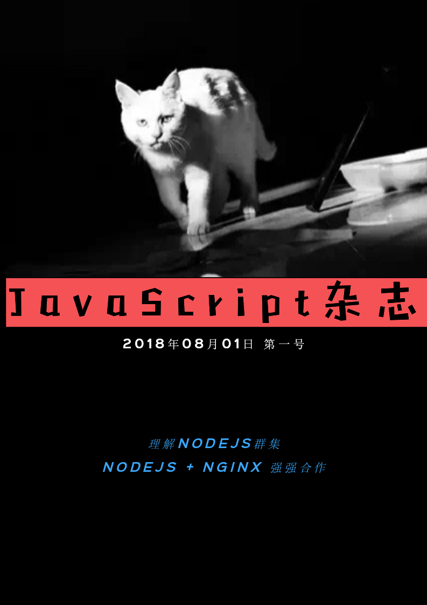

# Summary
* [Nodejs事件循环解析](doc/understandingeventloop.md)
* [Nodejs选型考量](doc/nodejssel.md)
* [Nodejs并行实践问答](doc/concurrent.md)
* [广告](ad/vuebook.md)
* [Nginx的大并发支持方法](doc/Nginxway.md)
* [浅谈Node.js的工作原理及优缺点](doc/nodeprincle.md)
* [Nodejs也引入线程了](doc/thread.md)
* [Nodejs群集方法](doc/cluster.md)
* [Nodejs+ Nginx强强合作](doc/nginxnode.md)
* [一种相对成熟的群集产品-PM2](doc/pm2.md)
